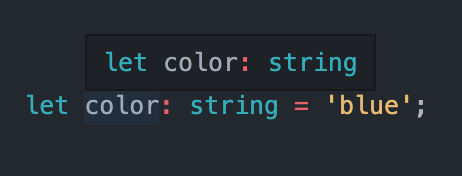
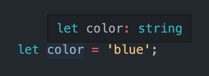

<div id="top"></div>

<!-- PROJECT LOGO -->
<br />
<div align="center">
  <a href="https://github.com/othneildrew/Best-README-Template">
    
  </a>

  <h3>Typescript Documentation</h3>

  Typescript is Javascript, it adds static typing to Javascript.

  Typescript need a compiler to run on top of Javascript.

  Typescript help us avoid assigning different values in our variable or functions, and suggests what type of variable we can use, it also help us see any property available for our variables.

  

 <br/>
 <br/>
</div>

<!-- TABLE OF CONTENTS -->
<details>
  <summary>Table of Contents</summary>
  <ol>
    <li><a href="#setup">Setup</a></li>
    <li><a href="#type-annotations">Type Annotations</a></li>
    <li><a href="#type-inference">Type Inference</a></li>
    <li><a href="#when-to-use-type-annotations">When to use Type Annotations</a></li>
    <li><a href="#functions-annotation-and-inference">Functions Annotation and Inference</a></li>
    <li><a href="#destructuring-with-annotations">Destructuring with Annotations</a></li>
    <li><a href="#typed-arrays">Typed Arrays</a></li>
    <li><a href="#tuples-in-typescript">Tuples in Typescript</a></li>
    <li><a href="#interfaces">Interfaces</a></li>
  </ol>
</details>

## Setup

### :zap: Installing Typescript compiler

We need a compiler for our typescript to run in the browser or in node environment.

```
npm install -g typescript ts-node
```

- typescript: will convert our ts to js
- ts-node: will convert our ts to js and automatically run the code in node

To check if we successfully install typescript:

```
tsc --help
```

tsc means typescript compiler

###### Example

Testing tsc if it converts to js. (To create a typescript file, we just need to give it a ts file extension)

```javascript
#index.ts

import axios from 'axios';

const url = 'https://jsonplaceholder.typicode.com/todos/1';

axios.get(url).then((response) => {
  console.log(response);
});
```

```
tsc index.ts
```

this will generate an index.js which we will run in node or in the browser. But its a bit cumbersome to run 2 commands (converting and running).

That's why we installed ts-node. Which convert and run our typescript in the node server.

```
ts-node index.ts
```

<br/>

## Type Annotations

<div align="center">
  
</div>

Type Annotations is a code(type) we add to tell Typescript what type a variable should be.

- "I am string" -> string
- 22 -> number
- "March 22, 1992" -> Date

###### Examples:

```typescript
let apples: number = 5;
let fruit: string = 'apple';

let nothingMuch: null = null;
let nothing: undefined = undefined;

// Built in objects:
const now: Date = new Date();

// Array
const colors: string[] = ['red', 'blue', 'green'];
const peopleAges: number[] = [22, 60, 15, 5];
const status: boolean[] = [true, false, false];

// Class instance
class Car {}
let car: Car = new Car();

// Object literals
const point: { x: number; y: number } = {
  x: 10,
  y: 29,
};

// Functions
const logNumber: (i: number) => void = (i: number) => {
  console.log(i);
};

const logAndReturnNumber: (i: number) => number = (i) => {
  console.log(i);
  return i + 10;
};

const logAndReturnNumberInferenceArgument = (i: number): number => {
  console.log(i);
  return i + 10;
};
```

<details>
  <summary><h5>:interrobang: Why do we have to write "i: number" in the function declaration. Why 2 times the same?</h5></summary>

In terms of why you put `i: number` twice, it's because it's not the same i each time. The second is the actual argument or parameter to the function. The first is a type annotation of what type of argument will be passed as a parameter.

For example, they could be different letters:

```javascript
const logNumber: (z: number) => void = (i: number) => {};
```

<p>Here note that I've used z for the first one, i for the second. The first (z) is the annotation of the type; the i is the actual variable. You could leave the i without a type annotation:</p>

```javascript
const logNumber: (z: number) => void = (i) => {};
```

<p>Here the type of i will be inferred to be number. But note that you wouldn't want to do this:</p>

```javascript
const logNumber: (z) => void = (i: number) => {};
```

<p>Here I've left z without a type annotation but put back in the annotation for i. What this would do is give you a type warning saying that z is implicitly of the "any" type.</p>

<p>The same exact thing would apply if you replace my z with the i in the original example.</p>

```javascript
const logNumber: (i) => void = (i: number) => {};
```

<p>Here I replaced my z with the i and you would get that same type warning. That shows why you have two places where you type annotation with number.</p>

<p>This isn't to say you must have both. You can frame the situation where you don't have to use two:</p>

```javascript
const logNumber = (i: number): void => {};
```

<p>There, however, you are not fully annotating the function.</p>

</details>

<br/>

## Type Inference

<div align="center">
  
</div>

Inference is that Typescript will automatically assign a type to our variable.

###### Examples:

```javascript
let pet = 'Dog'; // Typescript will automatically assign it with "string" type
let age = '30'; // automatically type number

age = 'something'; // will have an error -- Type "string" is not assignable to type "number"
```

If Typescript can not determine the type of our variable or function, the type will become `any`.

> Must avoid variables with type `any` at all costs

<p align="right">(<a href="#top">back to top</a>)</p>

<br/>
<br/>

## When to use Type Annotations

<details>
  <summary>1. When a function return's the <i>any</i> type</summary>

  ```javascript
  const json = '{"x": 10, "y": 20}';
  const coordinates = JSON.parse(json);
  console.log(coordinates); // {x: 10, y: 20}

  coordinates.somethingsomething;
  ```

  In above example, even though `somethingsomething` doesn't exist, typescript will not notify us.
  Because typescript automatically assign type `any` to our coordinates.

  `any` means typescript doesn't know what type should be assign to it, it's like we're not using typescript in here.
  since we are using typescript, we should avoid the type `any`. Because the purpose of typescript, is to assign a type to our variables or functions.

  > When assigning a type in a variable like string, numbers, etc.,
  > typescript help us see all available method or properties for that specific variables

  ```javascript
  let myName: string = 'emman';
  // by typing "myName", typescript will suggest all available properties for string like ".toLowerCase"

  // For coordinates example above, adding type notation:
  const json = '{"x": 10, "y": 20}';
  const coordinates: { x: number; y: number } = JSON.parse(json);
  console.log(coordinates); // {x: 10, y: 20}
  ```
</details>

<details>
  <summary>2. When we declare a variable on one line and initialize it later</summary>

  ```javascript
  let words = ['pet', 'food', 'colors'];
  let foundWord: boolean;
  // let foundWord = false;

  for (let i =0; i < words.length; i++) {
    if (words[i] === 'food') {
      foundWord = true;
    }
  }
  ```

  > In above example,
  > if we know the variable would be boolean, best way is to assign it to "false"
  > We just want to show - When we declare a variable and initialize it later
</details>

<details>
  <summary>3. Variable whose type cannot be inferred correctly (When Inference Doesn't Work)</summary>

  <p>
    For example we declare a variable that has a default boolean value, but later on, we want to change it's value to a number or boolean again.
  </p>

  ```javascript
    let numbers = [10, 25, 50];
    let greaterThanTwenty: boolean | number = false; // could be boolean or a number

    for (let i = 0; i < numbers.length; i++) {
      if (numbers[i] > 20) {
        greaterThanTwenty = numbers[i];
      }
    }
  ```
</details>

<p align="right">(<a href="#top">back to top</a>)</p>

<br/>
<br/>

## Functions Annotation and Inference

### Type Annotations for Functions

Code we add to tell Typescript what type of arguments a function will receive and what type of values it will return.

###### Type annotations example:

```typescript
  const add = (a: number, b: number): number => {
    return a + b;
  }

  const multiply = function(a: number, b:number): number {
    return a * b;
  }

  function divide(a: number, b:number): number {
    return a / b;
  }

  const nothing = (message: string): void => {
    console.log(message);

    // return undefined;
    // return null;
  }

  const throwError = (message: string): never => {
    throw new Error(message);
  }
```

For difference between `void` and `never`:

<b>Void</b> - it return void which is undefined

> The intent of void is that a function's return value will not be observed.

<b>Never</b> - it never returns anything


### Type Inference for Functions

Typescript tries to figure out what type of value a function will return.

###### Type inference example:

```typescript
  const add = (a: number, b: number) => {
    return a + b;
  } // type will automatically be a number

  const subtract = (a: number, b: number) => {
    console.log(a - b);
  } // type will automatically be a void (no return = void)

  const multiply = (a, b) => {
    return a * b;
  } // type will automatically be a number

  const addString = (a, b) => {
    return a + b;
  } // type will automatically be any
```

Typescript will automatically assign a return `type` base in what we return.

If we omit the return, then the type will be `void`.

Typescript won't do inference in a function argument, instead it will assign type `any` for the argument.

<br/>
<br/>

<p align="right">(<a href="#top">back to top</a>)</p>

<div align="center">
  
</div>

## Destructuring with Annotations

###### Examples

```typescript
// with a Function
const currentWeather = {
  date: new Date(),
  weather: 'Sunny'
}

const logWeather = ({date, weather}: { date: Date, weather: string}): void => {
  console.log(date);
  console.log(weather);
}

logWeather(currentWeather);

// with Object
const profile = {
  name: 'Alex',
  age: 20,
  coords: {
    lat: 0,
    lang: 15
  },
  setAge(age: number): void {
    this.age = age;
  }
}

const { age }: { age: number } = profile;
const {
  coords: { lat, lang }
}: {
  coords: { lat: number; lang: number }
}  = profile;
```

<br/>
<br/>

<p align="right">(<a href="#top">back to top</a>)</p>

## Typed Arrays

Arrays where each element is some consistent type of value.

###### Examples

```typescript
// Inference
const carMakers = ['ford', 'toyota', 'honda']; // string[]
const carLists = []; // any[]
const birthdays = [new Date(), new Date()]; // Date[]
const holidays = [new Date(), 'January 22, 2030']; // (string | Date)[]

// some Inference 2d arrays
const carsByMake = [
  ['f150'],
  ['corolla', 'vios'],
  ['camaro']
]; // string[][]

const some2DArray = [
  ['test'],
  [3, 4],
  [{
    pet: 'Dog'
  }]
];
// const some2DArray: (string[] | number[] | { name: string; }[])[]

// Annotations
const carMakers2: string[] = ['chevy', 'bmw', 'jeep'];
const carLists2: string[] = [];
const carsByMake2: string[][] = [
  ['f150'],
  ['corolla', 'vios'],
  ['camaro']
];
```

<p>:beginner: It's always better to use Inference when declaring a variable.</p>

<p>:beginner: Hovering over a variable(inference) in your IDE, will show a descriptive annotation about it.</p>

<p>:beginner: TS can prevent us from adding incompatible values to the array.</p>

```typescript
const carMakers = ['ford', 'toyota', 'honda']; // string

carMakers.push(200);
// Typescript will give us an error that carMakers array only accept's string
```

<p>:beginner: Can get help with map, forEach, reduce and other same functions by suggesting properties or method for specific type</p>

```typescript
const carMakers = ['ford', 'toyota', 'honda']; // string

carMakers.map((car: string): string => {
  return car.toLowerCase();
  // when you type car. ~ typescript will then suggest some helpful properties like toLowerCase()
});
```

<h5>:interrobang: Where to use typed arrays?</h5>

> Any time we need to represent a collection of records with some arbitrary sort order.

<br/>
<br/>

<p align="right">(<a href="#top">back to top</a>)</p>

## Tuples in Typescript

Array-like structure where each element represents some property of a record.

```typescript
// example we wanna create a tuple same as this object:
const drink = {
  color: 'brown',
  carbonated: true,
  sugar: 40
}

// now in Tuples
const pepsi: [string, boolean, number] = ['brown', true, 40];

// or with Alias
type Drink = [string, boolean, number];

const coke: Drink = ['brown', true, 40];
const orange: Drink = ['orange', false, 50];

coke[0] = 22;
// Typescript will throw an error - saying the first element[0] should be a string
// we can only change the value base on the type we give in our Tuple
```

This will allow us to make sure what type of value to pass in an array.

<br/>
<br/>

<p align="right">(<a href="#top">back to top</a>)</p>

## Interfaces

Creating a new custom type that we will define, just the same way that we have a string, numbers, etc.

A new type that describe's the property names and value types of an object.

###### Examples:

```typescript
const oldCivic = {
  name: 'civic',
  year: 2000,
  broken: false,
};

const printVehicle = (vehicle: {
  name: string;
  year: number;
  broken: boolean;
}): void => {
  console.log(`Name: ${vehicle.name}`);
  console.log(`Year: ${vehicle.year}`);
  console.log(`Broken: ${vehicle.broken}`);
};

printVehicle(oldCivic);
```

In our example above, imagine if we have long list of keys, example a user with all it's detail.

We will be creating a long list of notation. Something like:

```
(vehicle: {
  name: string;
  year: number;
  broken: boolean;
})
```

And if we reuse our `printVehicle` function above, we will be doing a lot of duplicate code.

The solution would be `Interface`.

```typescript
interface Vehicle {
  name: string;
  year: number;
  broken: boolean;
}

const oldCivic = {
  name: 'civic',
  year: 2000,
  broken: false,
};

const printVehicle = (vehicle: Vehicle): void => {
  console.log(`Name: ${vehicle.name}`);
  console.log(`Year: ${vehicle.year}`);
  console.log(`Broken: ${vehicle.broken}`);
};

printVehicle(oldCivic);

// BAD EXAMPLE
const oldToyota = {
  name: 'corolla',
  year: 1997,
  // broken: false,
};

printVehicle(oldToyota);

// since oldToyota won't pass the `broken` key-value
// we will get an error that says "'broken' does not exist on type 'Vehicle'"
```

By doing the above example, `printVehicle` function should meet the specification provided by the `Vehicle` type, it must accept an object with a <b>name as a string</b>, <b>year as a number</b>, <b>broken as a boolean</b>.

#### Naming of Interface

> Should follow a naming convention for Interfaces, most likely you will discussed it with your teams to avoid clashing of names. There is no standard for the naming conventions by the language itself.

> Make it Generic, Use PascalCase for interface names.

> Should not have I or Interface in the name or any other way of identifying it as an interface.

<p align="right">(<a href="#top">back to top</a>)</p>
